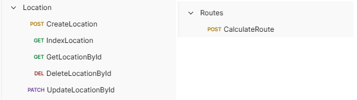

# Laravel ile Location Service

## Teknolojiler

- **Laravel:** API geliştirme için Laravel kullanıldı.
- **MySQL:** Konum verilerinin saklanması için MySQL veritabanı kullanıldı.
- **Postman:** API testleri için Postman kullanılarak işlevsellik doğrulandı.
- **React** Kullanıcı arayüzü geliştirmek için React kullanıldı.
- **Tailwind CSS:** Şık ve modern bir tasarım için Tailwind CSS kullanıldı.
- **Leaflet:** Harita ve konum bazlı gösterimler için Leaflet kütüphanesi kullanıldı.
- **Axios:** Axios: API isteklerini yönetmek için Axios kullanıldı.
- **React Icons:** UI'yi geliştirmek için React Icons ile ikon desteği sağlandı.  

## Katmanlı Mimari  

Projede daha düzenli ve yönetilebilir bir yapı oluşturmak için **Controller, Model ve Request katmanları** kullanıldı. 

## Validasyon Katmanı  

Bu proje, Laravel'in **Request Class** yapısını kullanarak validasyonu modüler hale getirir.  
Validasyon kuralları **app/Http/Requests/** klasöründe tanımlanmıştır.  

## ORM (Eloquent)
Laravel’in Eloquent ORM yapısı kullanılarak veritabanı işlemleri daha esnek ve yönetilebilir hale getirildi.  

## Rota Hesaplama Yöntemi
Bu projede, birden fazla konum arasında en uygun rotayı hesaplamak için Haversine Formülünü kullanmaktadır. 

## Rate Limit
Proje, API isteklerini IP adresi bazında sınırlamak için bir rate limit mekanizması kullanmaktadır. Her IP adresine dakikada 10 istek sınırı konulmuş olup, bu sayede aşırı yüklenmeler ve kötüye kullanım engellenmektedir.

## Eksiklikler
Dockerize: Proje, Docker container içinde çalıştırılabilir olmalıdır. Dockerize işlemi kısa süre içinde tamamlanacaktır.

Uygulama içi testler de gerçekleştirilerek, projenin tüm işlevselliği doğrulanacaktır.