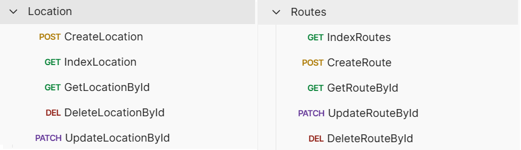

# Laravel ile Location Service

## Teknolojiler

- **Laravel:** API geliştirme için Laravel kullanıldı.
- **MySQL:** Konum verilerinin saklanması için MySQL veritabanı kullanıldı.
- **Postman:** API testleri için Postman kullanılarak işlevsellik doğrulandı.
- **React** Kullanıcı arayüzü geliştirmek için React kullanıldı.
- **Tailwind CSS:** Şık ve modern bir tasarım için Tailwind CSS kullanıldı.
- **Leaflet:** Harita ve konum bazlı gösterimler için Leaflet kütüphanesi kullanıldı.
- **Axios:** Axios: API isteklerini yönetmek için Axios kullanıldı.

