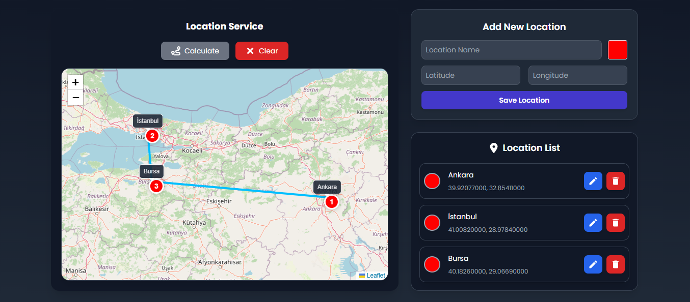
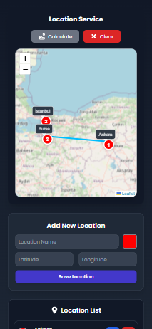

# Laravel ile Location Service

## Teknolojiler

Backend Teknolojileri

- **Laravel:** API geliştirme için Laravel kullanıldı.
- **MySQL:** Konum verilerinin saklanması için MySQL veritabanı kullanıldı.
- **Eloquent ORM:** Veritabanı işlemleri için kullanıldı.
- **Service Katmanı:** İş mantığını ayrıştırarak daha modüler bir yapı sağlandı.
- **Request Class:** Validasyonu merkezi hale getirerek güvenliği artırdı.
- **Rate Limiting:** API isteklerini IP bazlı sınırlayarak kötüye kullanımı önledi.
- **Haversine Formülü:** En uygun rota hesaplaması için kullanıldı.
- **Postman:** API testleri için Postman kullanılarak işlevsellik doğrulandı.

Frontend Teknolojileri

- **React & Tailwind CSS:** Kullanıcı arayüzü için modern ve şık bir tasarım sağlandı.
- **Leaflet:** Harita ve konum bazlı gösterimler için Leaflet kütüphanesi kullanıldı.
- **Axios:** API isteklerini yönetmek için kullanıldı.
- **React Icons:** UI'yi geliştirmek için React Icons ile ikon desteği sağlandı.  
- **React Color Picker** Kullanıcının konum işaretleyicisi için renk seçmesine olanak tanıyan bir renk seçici (Color Picker) eklendi.
- **useMemo:** LocationList’in gereksiz render edilmesini önleyerek performans iyileştirildi.
- **Spinner:** LocationList yüklenirken kullanıcıya bilgi vermek için eklendi.
- **Responsive Tasarım:** Arayüz, tüm ekran boyutlarına uyum sağlayacak şekilde optimize edildi

## Postman Testleri

## Uygulama Görselleri

## Eksiklikler
Dockerize: Proje, Docker container içinde çalıştırılabilir olmalıdır. Dockerize işlemi kısa süre içinde tamamlanacaktır.

Uygulama içi testler de gerçekleştirilerek, projenin tüm işlevselliği doğrulanacaktır.